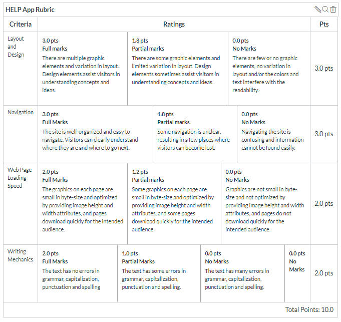

# pbl-lifeline-links

Provides links to custom websites developed based on client-provided information

- [Client content](https://github.com/denisecase/pbl-lifeline)

## Section 1

- [Group 01-01](https://cweltonsmith.github.io/pbl-website/index.html)
- [Group 01-02](https://rethima-reddy.github.io/Help-app/)
- Group 01-04 [Group 04](https://dakotagrvtt.github.io/pbl-lifeline/)
- Group 01-06 [Group 06](https://jeevanreddymure.github.io/Help/)
- Group 01-07 [Website](https://kdibben.github.io/group-7-help-app/)
- Group 01-08 [Group 08](https://jyothsna5268.github.io/group8-help-app/)

## Section 2

- Group 02-02 [Group 02](https://aawajjoshi.github.io/pbl-lifeline/)
- Group 02-03
- [Group 02-04](https://terry-woosley.github.io/help-app/)
- [Group 02-06](https://anil-bomma.github.io/pbl-help-app/)
- Group 02-07 [help-app-07](https://prudhvi15.github.io/help-app-07/)
- Group 02-08 [Group-8](https://suma-gitrep.github.io/help-app/)

## Section 4

- Group 04-01 [Group 01](https://chinmayi98.github.io/help-app/)
- Group 04-02 [Group 02](https://nikithakethireddy1996.github.io/help-app/)
- [Group 04-03](https://prasu93.github.io/help-app/)
- [Group 04-04](https://sravani537520.github.io/Help_app/)
- [Group 04-05](https://chetankudaravalli16.github.io/Help-app-05/)
- [Group 04-06](https://gorantla96.github.io/group6/)
- Group 04-07
- Group 04-08 [Group-8](https://sushmita-rudra.github.io/help-app-08/)

## Scoring

Sites will be reviewed based on the following criteria. 

## Submitting Scores

If performing a review, please go the [Word document](./scoring/Client-Side-App-Rubric.docx) and click download to get a local copy. Edit the document to include your scores and comments and submit as requested.

